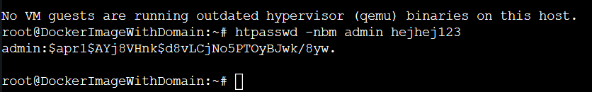
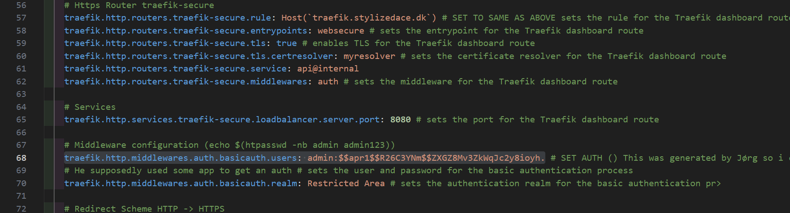

# remote-docker-setup

## Important parts:

Line 29: provider is digitalocean  
Line 31: should be your own email, personal email is fine  
Line 32: I already set for you, leave that as is, but it loads your certificates    
Line 35: should be your DigitalOcean Auth token, which you can generate on the side  
 - digitalOcean > API > Generate Token > YES TO READ AND YES TO WRITE > GENERATE.)  
   
Line 53: should be an "endpoint of your choice, i chose Host('traefik.stylizedace.dk')
- write the same exact thing on line 58  

Line 69: will be basicauth  which will need a few extra steps, follow these below  

How to get basicauth keygeneration:

in the access console (or using ssh connection) you just gotta install apache2-utils to be able to hash a username and password using apache (MD5)

to get this util and be able to hash your own, do these steps:

#Steps

## step 1. install apache2-utils

```bash
 apt install apache2-utils
```
follow the prompts (it'll ask Y/N and which package, just say yes and choose the upper option.)

## step 2. generate a hash

```bash
htpasswd -nbm <username> <password>
```

# OBS: username and password is replaced with whatever username and password you would like to hash into a "key" (and remove the "<>" after )

## step 3. copy the hash into your compose file like so

### Take this last string (including admin and the period at the end)


and put it into your compose file like so:



now you have a basicauth key that you can use to access your traefik dashboard.

next is line 109: your restAPI endpoint, which should match the endpoint you wrote in line 53 and 58 but instead of 'traefik' like what i wrote, you write api.something"
example: Host('api.stylizedace.dk')

# Now you're done! C:

